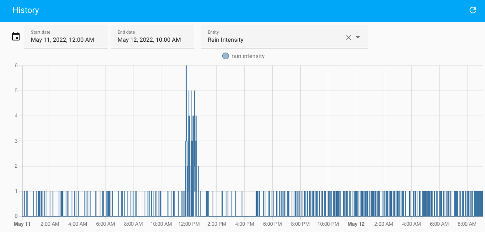
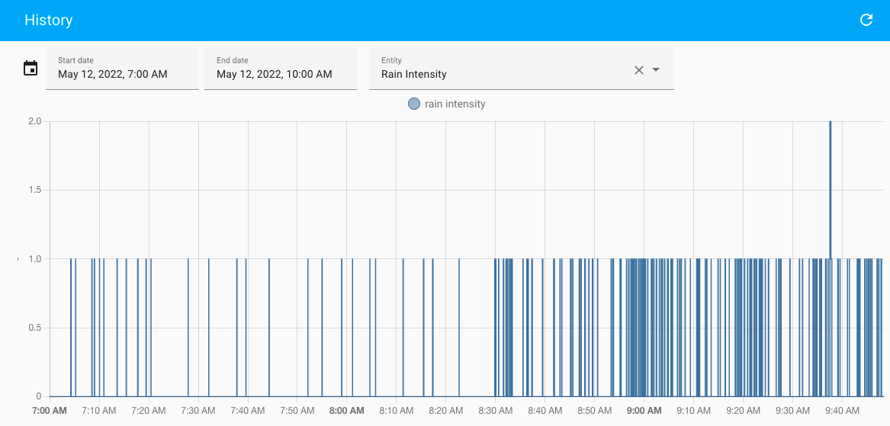
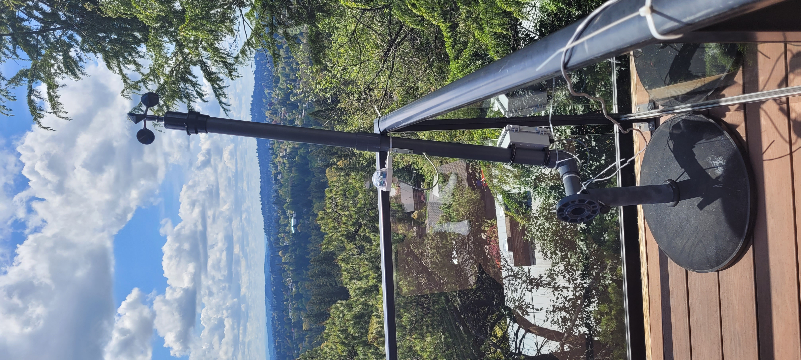
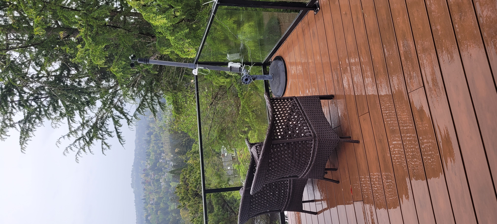

# Custom ESPhome Component for a RG-9 Rain Sensor

The [RG-9 rain sensor by Hydreon](https://rainsensors.com/products/rg-9/) is a laser-based sensor that detects the presence of water droplets on the surface of the transparent plastic dome. Unlike the cheaper and simpler resistive based water sensor, the sensor itself is not physically exposed to the elements, and it does not depend on the water evaporating to report that the rain as stopped.

When I originally built my weather station, I used the the J1 connector to power the sensor and read the 'OUT' signal connected to a pulled up input. However, the RG-9 proved to be very sensitive to power supply stability issues (I was using a DC/DC buck converter), creating a lot of false positives. I have zero knowledge of power supply and power converter design: I'm a digital guy where the world is made up of stable 1's and 0's. So I switched to the serial interface on J2, using the 3.3V pin on the ESP32 to power the sensor.

Using two wire pairs from a length of CAT5 cable, I connected the sensor to my [ESP32](https://www.mischianti.org/2021/02/17/doit-esp32-dev-kit-v1-high-resolution-pinout-and-specs/) as follows:

| ESP32 DEvKit | RG-9 J2 |
| ------------ | ------- |
| GND | Pin 1 |
| 3V3 | Pin 8 |
| TXD | Pin 5 |
| RXD | Pin 4 |

then created a UART-based custom components.

The RG-9 Custom Component resets the sensor every 18 hours approximately and puts it in polling mode. The sensor is polled every seconds, reporting any change in reported rain level as an integer 0 through 9 (contrary to [documentation](./UserGuide.pdf)!). If the sensor cannot be succesfully read for an hour, -1 is reported.

# WTF???

I'm getting *really* frustrated by this sensor. The results I'm getting make absolutely no sense. I got a spike up to R6 at 12:30 on May 11 and keep getting ever more frequent R1 readings. I thought a bird had landed on the lense and that low-level readings were just uncertainty in the sensor. But it finally started raining at around 8am on May 12 and lo-and-behold! The sensor continues to report "R1"!



| May 11, 13:04: Sunny | May 12, 09:03: Rainy |
|----------------------| ---------------------|
|||

I'm reporting the issue to Hydreon. Meanwhile, I DO NOT RECOMMEND!

[Follow the discussion on HomeAssistant's community board here](https://community.home-assistant.io/t/hydreon-rg-15-rain-sensor/332794/9)

# Debug

Everything read from the sensor's serial output is echoed to the debug log. A "on_reset" call service is provided to be able to manually reset the sensor via the "Developer's Tools" Service calling page, which will echo the reported device configuration in the logs.

```
[07:09:53][D][RG9:028]: 5: R 0
[07:09:54][D][RG9:028]: 5: R 0
[07:09:55][D][RG9:067]: Resetting RG-9...
[07:09:55][D][RG9:028]: 5: R 0
[07:09:56][D][RG9:028]: 5: R 0
[07:09:57][D][RG9:028]: 5: R 0
[07:09:58][D][RG9:028]: 5: R 0
[07:09:59][D][RG9:028]: 5: R 0
[07:10:01][D][RG9:028]: 5: R 0
[07:10:02][D][RG9:028]: 9: Reset D
[07:10:14][D][RG9:028]: 63: EmSat

;*****************************************************
[07:10:15][D][RG9:028]: 63: *******
; HYDREON MODEL RG-9 RAIN GAUGE
; SOFTWARE COPYRIGHT 
[07:10:16][D][RG9:028]: 63: (C) 2020 HYDREON CORPORATION
SW 1.000 2020.06.05
Emitters 100
[07:10:17][D][RG9:028]: 42:  100, EmTotal 200
DIP 0000
PwrDays 0


[07:10:18][D][RG9:028]: 63: R 0
R 0
R 0
p
R 0
R 0
R 0
R 0
R 0
R 0
R 0
R 0
R 0
[07:10:19][D][RG9:028]: 30: R 0
R 0
R 0
R 0
R 0
R 0
[07:10:20][D][RG9:028]: 5: R 0
[07:10:21][D][RG9:028]: 5: R 0
[07:10:22][D][RG9:028]: 5: R 0
```
